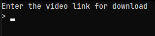

# Python-yt-dlp

`python-yt-dlp` is a wrapper for the [yt-dlp](https://github.com/yt-dlp/yt-dlp#readme) program that allows users to select their **resolution**, **fps**, **video extension**, **video codec**, and **audio codec**. The program still runs via CLI because my intention is to run it via a Windows Batch File (`.bat`).

## Usage

### 1. Enter the url



### 2. Choose whether you want to download audio/video


### 3. Download the 'best' format or custom


### 4. Choose your custom settings (Settings are based on what's available to download)


### 5. Your video/audio will be downloaded in your specified `download_path`

## Installation

1. Make sure [Python](https://www.python.org/downloads/) is installed
2. Make sure [7zip](https://www.7-zip.org/download.html) is installed (used for installing step 3 -- recommended)
3. Make sure [FFMPEG](https://ffmpeg.org/download.html) is installed (store it in your `download_path` or add it to `PATH`)
4. Download/Clone the repository
5. Create a `.env` file and store your `download_path`. In Powershell, type `New-Item .env` or in Bash, type `touch .env`. Edit the `.env` to contain `download_path=YOUR/DOWNLOAD/PATH/HERE`
6. Run `pip install -r requirements.txt`
7. Run `python main.py`

## Updating

1. Download/Clone the repository
2. Replace the old `main.py`, `helpers.py`, and `requirements.txt` files
3. Run `pip install -r requirements.txt` to ensure that the package versions are the same as the latest commit

## Example of Batch File

``` bat
@py.exe "PATH/TO/main.py" %*
@pause
```

``` bat
@py.exe "PATH/TO/gui.py" %*
@pause
```
